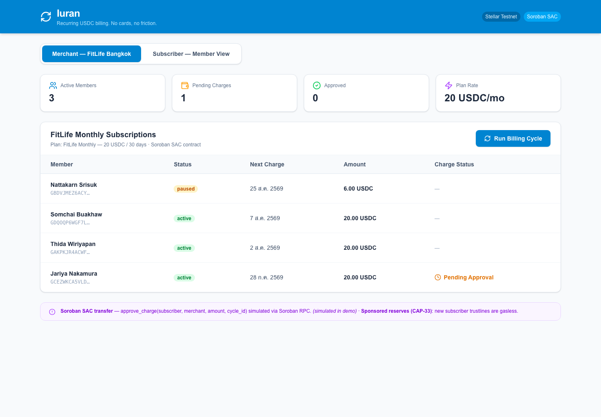
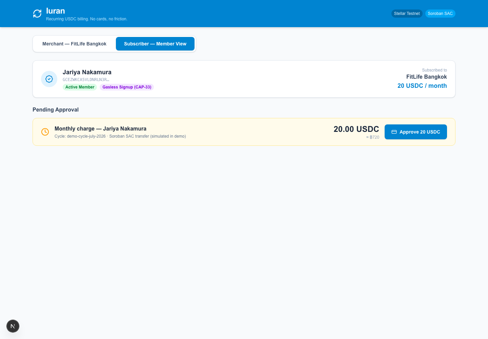
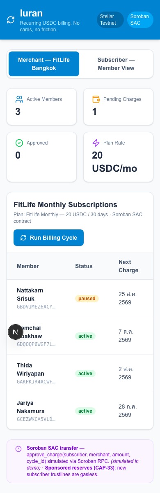

# Iuran — Recurring Subscription Billing

Iuran is a focused hackathon product for recurring membership billing. A merchant creates a plan, a member subscribes, and the contract records authorized recurring charges on Stellar.

## Demo

- Live demo: https://iuran-022.vercel.app
- Repository: https://github.com/DangGiaBao2/Iuran
- Demo data is intentionally in-memory so the public preview works without a database.
- Network: Stellar Mainnet
- Contract: `CBL2TOIOA4LDYKCSZR4VLQPJBFJJMOEXVJYRZ7GRYJJK7R7RNLPLOEQJ`
- Latest functional transaction (`charge`): [e50f0862…e7d28](https://stellar.expert/explorer/public/tx/e50f08624890c5fc691ff566051f26f9c9e8a9ad5946fd9f184dabda3f3e7d28)

## Product flow

1. Open the Merchant view for FitLife Bangkok.
2. Click **Run Billing Cycle** to create pending monthly charges.
3. Switch to **Subscriber — Member View**.
4. Click **Approve 20 USDC** and see the simulated transaction confirmation.

The product UI includes a demo-friendly workflow. The repository also contains a deployed Soroban contract and independently verifiable Mainnet transaction evidence.

## Screenshots

## Stellar surface

- Soroban contract authorization for recurring charge policy
- Horizon payment preparation and reconciliation
- Keeper-friendly due-schedule and expiry state machine

## Mainnet status

The subscription policy contract is deployed on Stellar Mainnet. The verified flow is `create_plan → subscribe → charge`; deployment metadata and all transaction hashes are recorded in [`contracts/subscription-policy/deployment.json`](contracts/subscription-policy/deployment.json).

Operational and technical documentation is available in [`docs/`](docs/).

## Local demo

Install dependencies and run `npm run dev`. Without database variables, the app automatically uses the safe in-memory demo store. For a database-backed local testnet demo, configure `.env.example` and use the scripts in `package.json`.

## Safety boundary

Wallet authorization stays with the user. The web application never stores a secret key. Production integrations should reconcile the submitted transaction hash before showing a charge as final.
